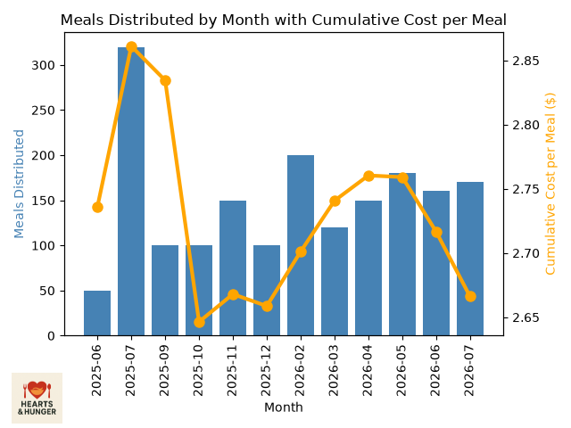
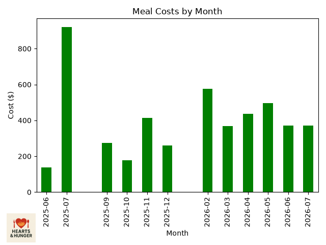
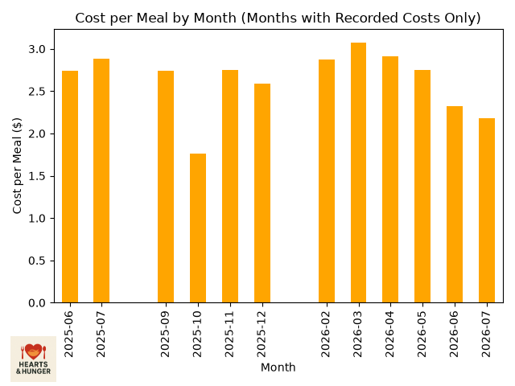

# Hearts & Hunger Meal & Donor Tracker

A Python + SQLite tool that tracks meal distribution, meal costs, and donor
contributions for **Hearts & Hunger**, a nonprofit outreach program I founded
that serves individuals experiencing homelessness in the Oklahoma City metro
area. This project replaced manual spreadsheet tracking with a real database
and generates automated reports and charts from the data.

## Why I built this

Since June 2025, Hearts & Hunger has distributed over 1,800 meals and raised
more than $1,200 through individual donors — all of which I was tracking by
hand. I built this tool to store that data properly, analyze trends over
time, and answer real questions like: is our cost per meal improving over time?*

## What it does

- **Logs meal distribution events** — date, location, meal count, notes, and cost
- **Logs individual donor contributions** — name, date, amount, payment method
- **Logs business/store donations** separately from individual donors
- **Generates text reports** — full meal log, cost log, monthly trends, donor totals
- **Generates charts**:
  - Meals distributed per month, combined with a running (cumulative) cost-per-meal line
  - Total meal cost by month
  - Cost per meal by month (for months with recorded costs)

## Sample output

**Meals distributed by month, with cumulative cost per meal**


**Meal costs by month**


**Cost per meal by month**


## Tech stack

- **Python** — core logic
- **SQLite** (`sqlite3`) — local database, three tables: `meals`, `donors`, `store_donations`
- **pandas** — data analysis (grouping, monthly trends, running totals)
- **matplotlib** — chart generation

## How it's structured

- `meal_tracker.py` — all database setup, data-entry functions, report functions, and chart functions
- `sample_seed_data.py` — example script showing how to log meals and donors (uses placeholder data; my real program data is kept private since it includes real donor names and is excluded via `.gitignore`)

## How to run it

1. Install dependencies:
   ```
   pip install pandas matplotlib
   ```

2. Add your own data by editing a seed script (see `sample_seed_data.py` for the format), then run it once to populate the database:
   ```
   python sample_seed_data.py
   ```

3. View reports and generate charts:
   ```
   python meal_tracker.py
   ```
   This prints the meal log, cost log, monthly trends, and donor summary to the console, and saves three PNG chart files.


## About Hearts & Hunger

Hearts & Hunger was founded in June 2025 and was integrated into the
ministries of the Cathedral of Our Lady of Perpetual Help in March 2026. The
organization coordinates volunteers, sponsors, and local businesses to
prepare and distribute meals to individuals experiencing food insecurity
throughout the Oklahoma City metro area.
